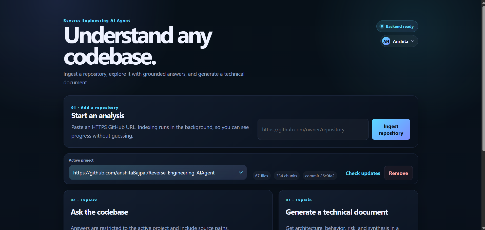

# Reverse Engineering AI Agent

Point this tool at any GitHub repository and ask questions about how it works. It clones the repo, chunks the source files, stores everything as embeddings in Postgres, and lets you query it in plain English or have it write a full reverse-engineering document for you.

## What it does

- **Ingest a repo** - paste a GitHub URL; the backend clones it, chunks the code, and loads it into a PGVector store
- **Ask questions** - RAG-backed Q&A over the codebase ("how does authentication work?", "where is the rate limiter?")
- **Generate a document** - runs a 4-step LLM chain (architecture → behaviour → risk → synthesis) and produces a Markdown report, exportable as PDF
- **Check for updates** - compares the ingested commit SHA against the current HEAD on GitHub and re-ingests on demand
- **MCP server** - optionally exposes the same tools over SSE so Claude Desktop (or any MCP client) can call them directly, no UI needed.

## Screenshots



## Tech stack

| Layer                       | What                                                          |
| --------------------------- | ------------------------------------------------------------- |
| Frontend                    | React 19 + Vite                                               |
| Backend                     | Spring Boot 3.3, Spring AI 1.0                                |
| LLM                         | OpenAI (gpt-4o-mini by default)                               |
| Embeddings                  | text-embedding-3-small                                        |
| Vector store                | PGVector (Postgres 16)                                        |
| Rate limits / usage budgets | Redis                                                         |
| Auth                        | Local accounts, HMAC-signed JWT in an httpOnly session cookie |
| Repo cloning                | JGit                                                          |

## Prerequisites

- Java 21
- Node 18+
- Docker (runs Postgres + Redis via `docker compose`)
- An OpenAI API key

## Getting started

**1. Start Postgres and Redis**

```bash
docker compose up -d
```

**2. Set up environment variables**

Copy `.env.example` to `.env` and fill in `OPENAI_API_KEY`. Set `JWT_SECRET` to a
random string of at least 32 characters - the backend signs its session tokens
with it, and it rejects known placeholders:

```bash
openssl rand -base64 48
```

Leave `SIGNUP_CODE` blank for open registration, or set it to require that value
in `POST /auth/register` before an account can be created.

**3. Start the backend**

```bash
cd backend
mvn spring-boot:run
```

The API will be at `http://localhost:8080`.

**4. Start the frontend**

```bash
cd frontend
npm install
npm run dev
```

Open `http://127.0.0.1:5173` in your browser.

## Limits

To keep token spend predictable:

- **Per-user, per-day** — each account may run a question or a document
  generation a fixed number of times per UTC day (`MAX_QUERIES_PER_USER`,
  `MAX_DOCUMENTS_PER_USER`, both `2`; `0` = unlimited). A slot is reserved
  before the LLM call and refunded if it fails; over the limit is rejected.
  Counters reset at 00:00 UTC and the running totals are visible in-app.
- **Daily token budget** — per identity (`DAILY_TOKEN_BUDGET`) and a combined
  ceiling across all accounts (`GLOBAL_DAILY_TOKEN_BUDGET`). Over budget is
  rejected until 00:00 UTC.
- **Project caps** — repos per account (`MAX_PROJECTS_PER_USER`) and in total
  (`MAX_PROJECTS_TOTAL`). Re-ingesting an existing project is always allowed.
  Abandoned local clones are swept hourly.
- **Concurrent ingests** — up to `MAX_CONCURRENT_INGESTS` (default `2`) repos
  ingest in parallel per instance; a second ingest of the same repo is rejected
  while the first runs. A re-ingest swaps the new version in atomically, so a
  failed one leaves the previous version intact.
- **Rate limits** — per-IP / per-user token buckets on every endpoint, backed by
  Redis (in-memory fallback if Redis is down, unless `REDIS_REQUIRED=true`).
- **Repo host allowlist** — only hosts listed in `ALLOWED_REPO_HOSTS` (`github.com`
  by default) can be ingested, and file count/size/total-source caps
  (`MAX_FILES_TO_LOAD`, `MAX_FILE_BYTES`, `MAX_TOTAL_SOURCE_CHARS`) bound each ingest.

## MCP (Claude Desktop)

When enabled, the MCP endpoint is **unauthenticated** and assumed localhost-only;
disable it with `MCP_ENABLED=false` for any shared or hosted deployment. MCP
projects are stored separately from web accounts and are not visible through the
web UI.

The server runs at `http://localhost:8080/sse`. Add it to your Claude Desktop config:

```json
{
  "mcpServers": {
    "reverse-engineer": {
      "url": "http://localhost:8080/sse"
    }
  }
}
```
